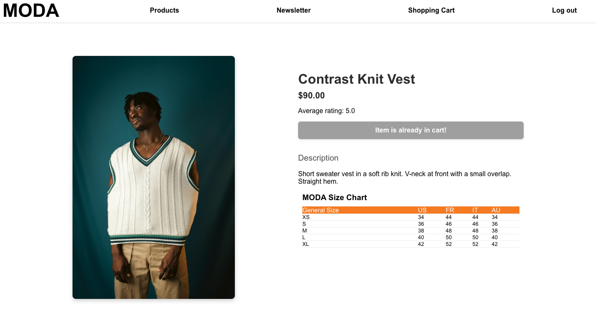
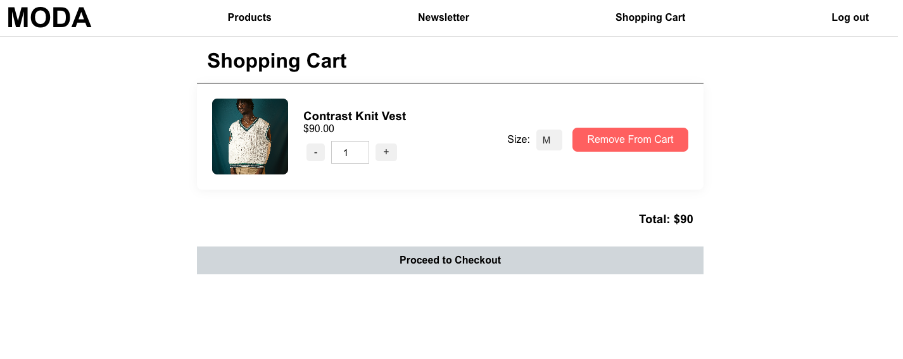
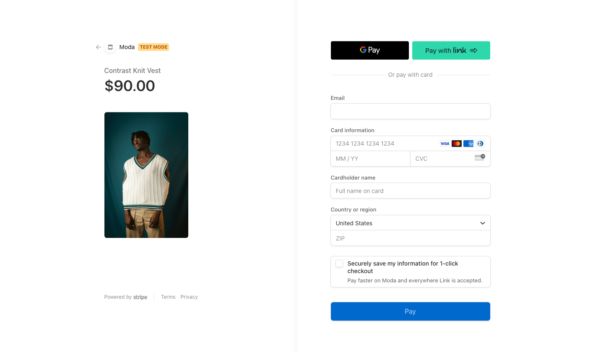
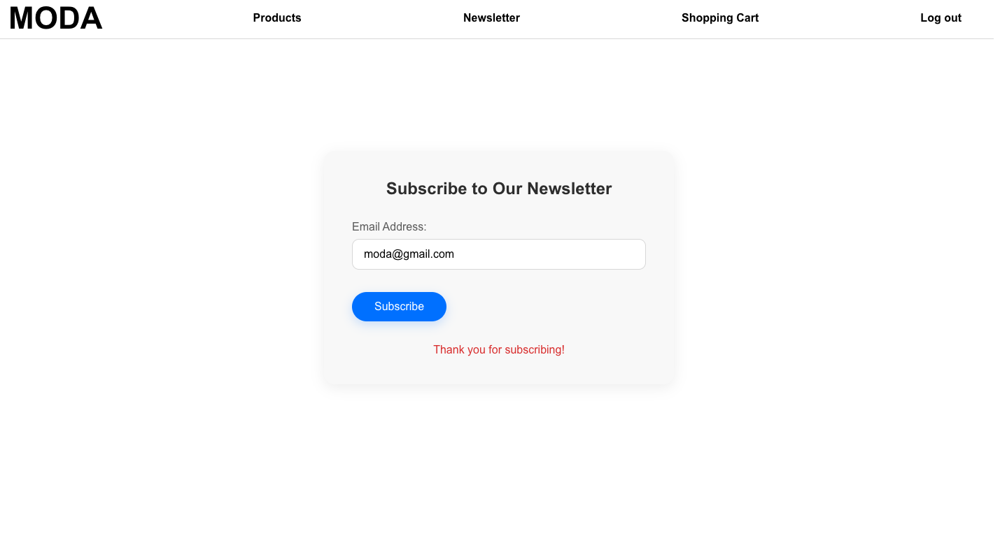
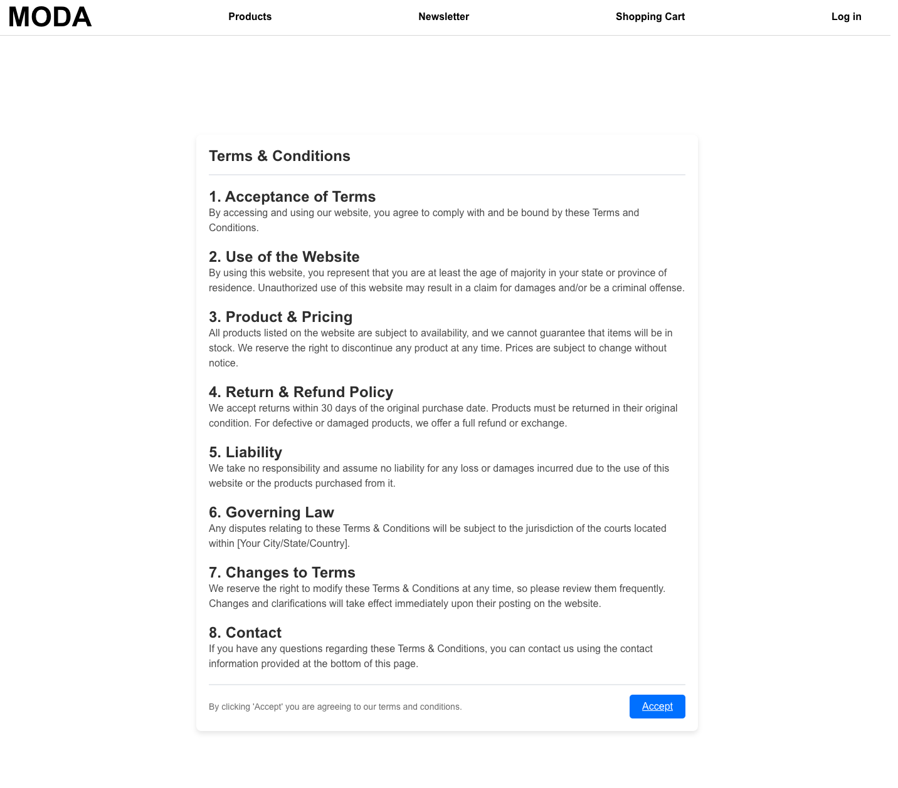

# MODA : E-Commerce Application 
- MODA is a web-based e-commerce application that showcases and sells trendy clothes!

## Screenshot 

### Homepage

### Products Page

### Product Details Page 

### Cart Page

### Checkout Page

### Newsletter Page 

### Terms and Conditions Page

## Technologies Used 
- Vue.js 
- MongoDB
- Express
- Node.js
- Vuetify (styling)
- Stripe (payments)
- Auth0 (authentication)

## Getting Started 

- npm install

## Acknowledgements 

- vue.js: 
1. https://vuejs.org/guide/introduction.html
2. https://developer.mozilla.org/en-US/docs/Learn/Tools_and_testing/Client-side_JavaScript_frameworks/Vue_getting_started

- vuetify:
1. https://vuetifyjs.com/en/components/cards/
2. https://docs.servicestack.net/templates/vuetify

- stripe: 
1. https://dashboard.stripe.com/test/developers
2. https://dashboard.stripe.com/test/dashboard
4. https://priyankdesai515.medium.com/ 

## License 

Distributed under the MIT License. See `LICENSE` for more information.

## Future Features 
- Additional product categories such as accessories 
- Purchase reviews for each product on product details page 
- Wish list for users to save favorites 
- Search functionality for specific products 
- Cart item preview pop-up when new item is added to cart
- Multi-page product listing (pagination)
- Sale items and different price structure 
- 'What's my size' feature with user's input such as height 

